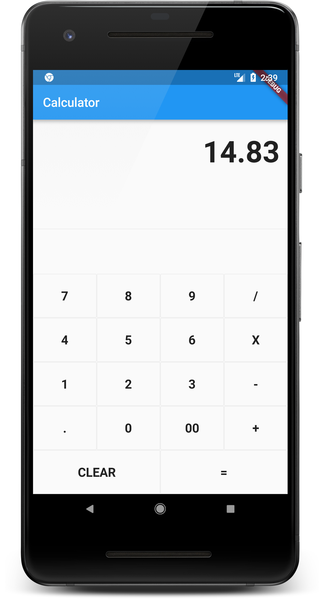

# Flutter Calculator App



This is a simple calculator app built using Flutter. It provides basic arithmetic operations such as addition, subtraction, multiplication, and division.

## Features

- User-friendly interface for performing calculations.
- Supports addition, subtraction, multiplication, and division operations.
- Clear button to reset the current input.
- Responsive design that works on both phones and tablets.

## Getting Started

To run this app on your local machine, follow these steps:

1. Ensure you have Flutter installed. If not, follow the instructions on the [official Flutter website](https://flutter.dev/docs/get-started/install).

2. Clone this repository to your local machine using Git:

   ```
   git clone https://github.com/your-username/flutter-calculator-app.git
   ```

3. Navigate to the project directory:

   ```
   cd flutter-calculator-app
   ```

4. Install the required dependencies:

   ```
   flutter pub get
   ```

5. Run the app:

   ```
   flutter run
   ```

## Usage

- Launch the app on your device or emulator.
- Enter numbers and use the buttons for arithmetic operations.
- Press the "=" button to see the result of the calculation.
- Use the "C" button to clear the current input.

## Screenshots


## Contributions

Contributions are welcome! If you find any bugs or have suggestions for improvements, please open an issue or submit a pull request.

## License

This project is licensed under the MIT License - see the [LICENSE](LICENSE) file for details.

---
